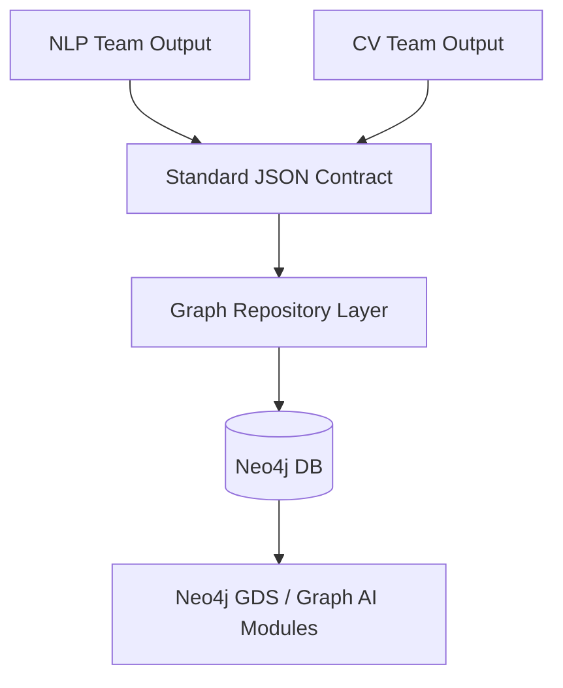

# AI-Based Crime Network Intelligence System - Knowledge Graph Foundation

This repository contains ONLY the Knowledge Graph and Graph AI structural foundation. 

## What This Repository Is Responsible For
- Structuring the Neo4j Graph Database architecture.
- Defining standard Entity and Relationship schemas.
- Providing a canonical Entity ID strategy.
- Establishing an ingestion contract for NLP and CV teams to send extracted data.
- Establishing the architectural skeleton for Graph AI algorithms (Centrality, Link Prediction, etc.).

## What It Does NOT Contain
- NO Dataset downloading or preprocessing (no real or fake crime data).
- NO NLP models or relation extraction.
- NO CV models or image processing.
- NO Frontend UI or Backend REST APIs.
- NO ML model training.

## Technology Stack
- **Python** (Data validation with Pydantic)
- **Neo4j** (Graph Database)
- **Neo4j Python Driver** (Database Connection)
- **Pytest** (Unit testing)

## KG Architecture

## Node Types
- `Person`, `Crime`, `Location`, `Organization`, `Vehicle`, `Case`, `Evidence`, `Event`.

## Relationship Types
Controlled vocabulary including: `INVOLVED_IN`, `ASSOCIATED_WITH`, `MEMBER_OF`, `LOCATED_AT`, etc.

## Canonical ID Strategy
All entities must have stable string IDs, formatted as `<type>:<unique_identifier>`. Examples: `person:123`, `crime:456`. Names are NOT identifiers.

## Integration
NLP and CV teams must ONLY produce JSON matching the `contracts/ingestion_contract.md`. They do not need to interact with Neo4j directly.

## Graph AI
The `graph_ai/` directory contains abstractions for projections and interfaces for centralities and link prediction algorithms. No execution is currently performed.
